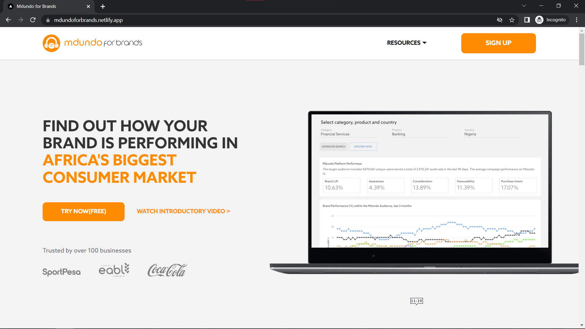
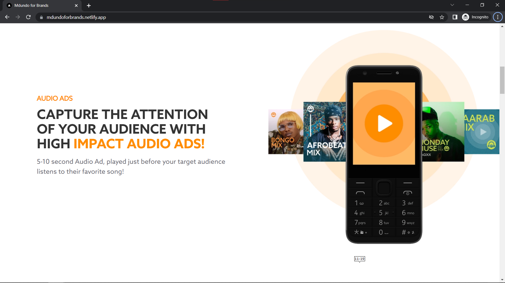
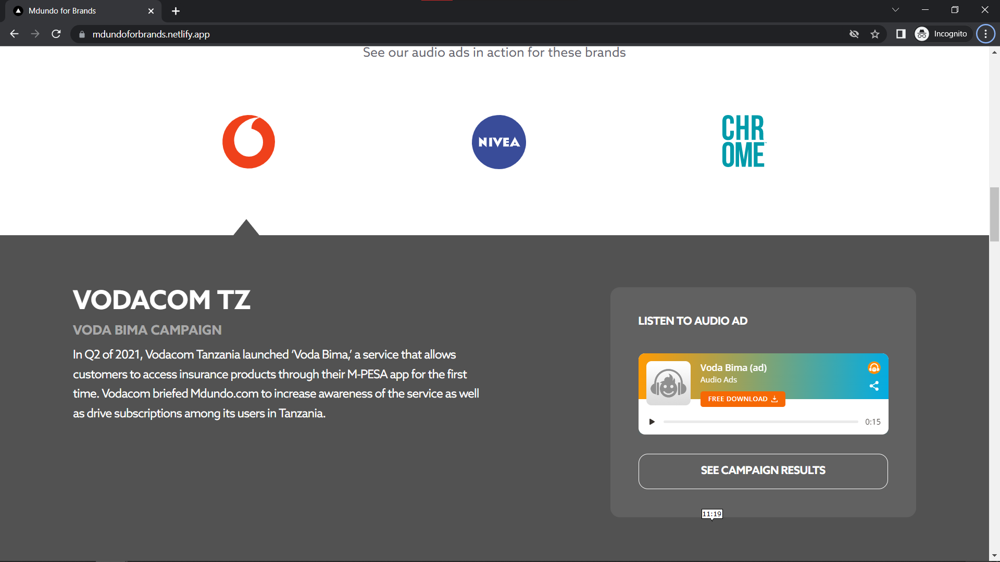
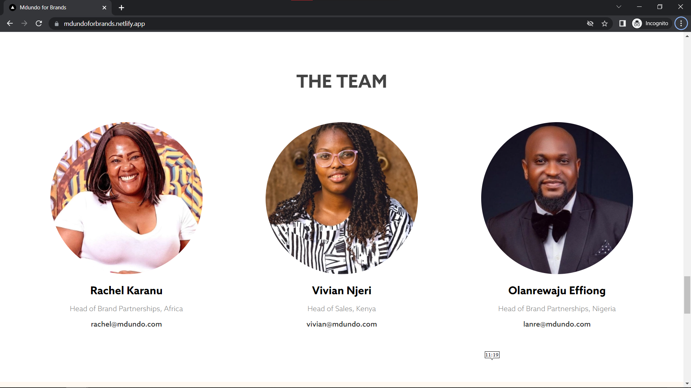
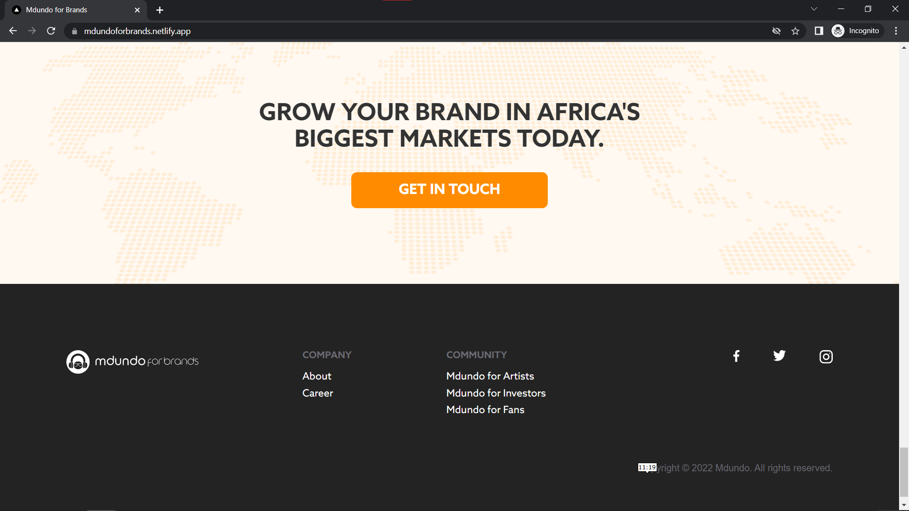

# Project Description
This is a frontend UI project built using the NextJs framework alongside SCSS for styling of the components.
Below are the details for the flow of the website

### Home Page

### Showcase Section

### Tabs Section

### Team Section

### Showcase Section

## Further information
The live preview of the website can be found at [Live Preview](https://mdundoforbrands.netlify.app/) \
Also here is a link to the [Wiki](https://github.com/GabrielAbubakar/mdundo-for-brands/wiki) docs for forking and local deployment of the codebase.
